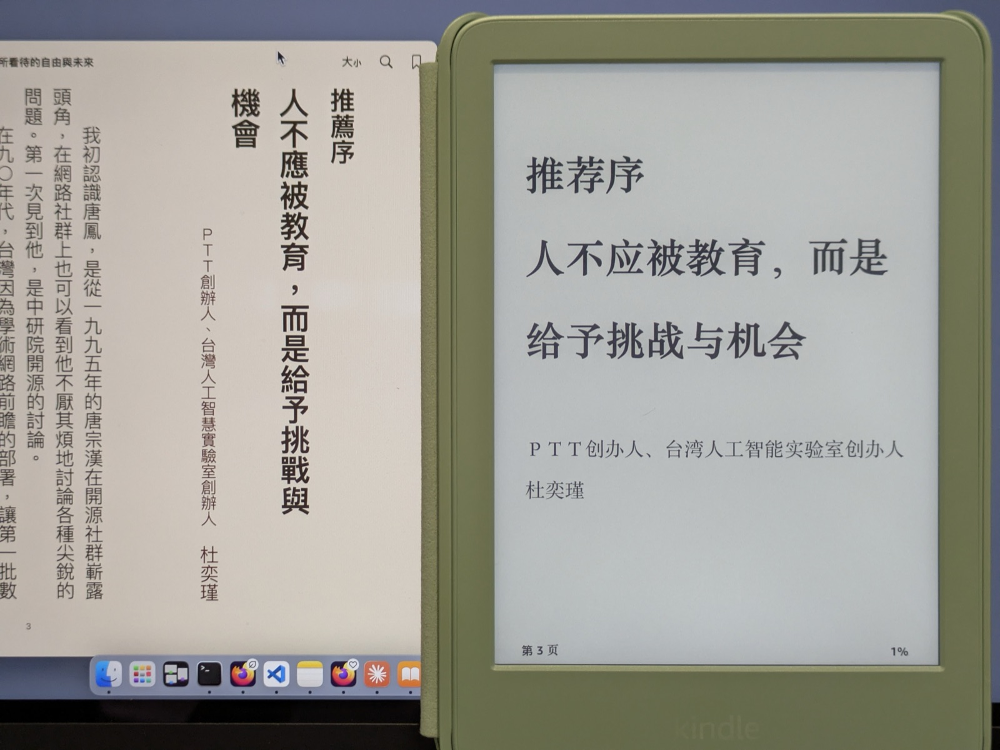
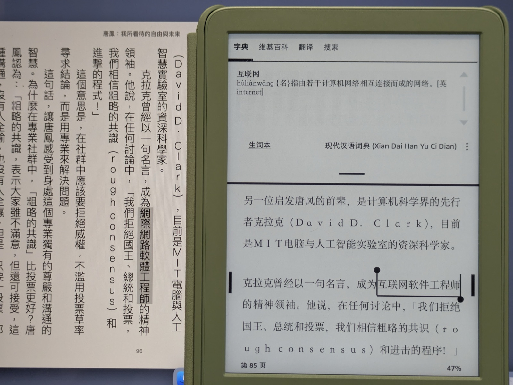
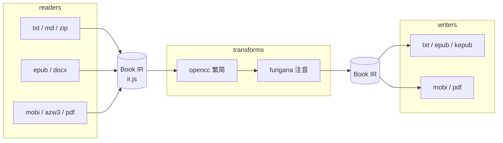

<p align="center">
  
</p>

<h1 align="center">书简 · shū jiǎn</h1>

<p align="center">
  电子书繁简转换 · 横竖重排 · 日语注音<br>
  🚀 快速开始 ｜ 
  <a href="https://shujian.ink"><b>shujian.ink</b></a> 
</p>

---

## 电子书繁简转换 · 横竖重排 · 日语注音

读韩寒的时候，我一度很想谈恋爱，能感到他胸口迸发出来的那股生命力。读林奕含的时候，我又一度因为一种说不清的肮脏而对情感过敏——

> 不知算不算是個遲到的傢伙。第一次閱讀的時候，涉世未深，課本下藏著的 Kindle 打發時間。
>
> 如今重讀，感覺她就像寫了一朵花，藍色的鬱金香，在淡藍天下搖曳。但是花心裡藏著家暴；藏著強姦；藏著被扭曲的愛；藏著窮得只剩下錢的人對優秀的人的自卑；藏著人性的惡。

横看成岭侧成峰，远近高低各不同。同一座山，站的位置不一样，看到的形状就不一样。人也是这样：见到的声音越多，对一件事的认识才越接近它本来的样子。

## 于是有了书简。把书拖进浏览器，选好转换格式，下载

它解决两件事。

## 一：繁简与排版

港台出的书多为繁体竖排右起,塞进 Kindle 能显示,但翻页方向反着来,「網際網路」「滑鼠」「軟體」这类措辞也要一路猜,每猜一次注意力就从书里被拽出来一次。

- **词级转换**,不是逐字查表 —— 「台灣人工智慧實驗室」→「台湾人工智能实验室」
- **地区用词是独立选项**:保留原文措辞 / 台湾用词 / 香港用词
- **排版重排**:竖排右起 ↔ 横排左起

## 二：日语标音

日文原著里的汉字看着认识,习惯性按中文发音念过去,其实不知道它念什么,词在脑子里过一遍就留不下记忆锚点。

- 片假名转平假名，标注在汉字上方,主流阅读器通用
- 注音范围可选:**全部汉字** / **只标生僻字**

> 完整的缘起随笔：[为什么做一个零服务器的电子书处理网站](https://lucky-ro.github.io/posts/why-create-shujian/)

---

## 它能做三件事

### 一、繁简互转

<p align="center">
  
</p>

上图。左边 Mac 上的 Apple Books 是原书，繁体、竖排、右起；右边 Kindle 上是同一页过了一遍书简之后——简体、横排。

注意署名那一行：「台灣人工智慧實驗室」变成了「台湾人工智能实验室」。

<p align="center">
  
</p>

同一本书的第 96 页。左边原文里高亮的是「網際網路軟體工程師」，右边转成了「互联网软件工程师」——转完之后，Kindle 里那本《现代汉语词典》才查得到这个词。

书简用 [OpenCC](https://github.com/BYVoid/OpenCC) 做**词级**转换，按词判断，而不是逐字查表。

「要不要换说法」这件事你说了算：**转换方向**和**地区用词**是两个独立的下拉。

| 地区用词 | 效果 |
| --- | --- |
| 保留原文措辞 | 只换字形，「網際網路」照旧变成「网际网路」。想读原汁原味，选这个 |
| 台湾用词 | 滑鼠 → 鼠标，軟體 → 软件 |
| 香港用词 | 港式惯用词表 |

### 二、横排竖排：随书还是随你

排版方向是一个单独的下拉：**保持原书 / 横排 / 竖排（直排）**。

读入 EPUB 时会从 `spine` 的 `page-progression-direction` 反推原书是不是竖排；导出时写进 `writing-mode`（同时带 `-epub-` / `-webkit-` 前缀与 `text-orientation: mixed`），主流阅读器都认。

竖排只在 **EPUB / KEPUB / PDF** 里有意义——TXT 与 MOBI 格式本身就没有排版方向这个概念，选了也不生效，页面上会当场提示你。

### 三、日语注音：把假名标回汉字头上

<p align="center">
  
</p>

右边是《雪国》开篇那一页的原文，左边是同一页——每个汉字头上都标好了小小的平假名，逐字对应。

对初学者来说，汉字终于可以直接拼读出来，于是能真正沉浸在日文语境里、泡在日文环境下学习，而不是靠中文发音把它糊弄过去。

<p align="center">
  
</p>

这张图才是我想要的完整形态。屏幕上「籠」字被选中，Kindle 弹出的是**《大辞泉》的纯日语词条**：かご【籠】，底下还带着惯用句。整个过程里没有一个中文字。

背单词表之所以低效，是因为它假设大脑按 ABCD 线性排列词汇。实际上一个词是靠它周围的一整张网被记住的：在哪句话里见过它、当时在读什么故事、那一页的心情是什么。**读原著 + 假名 + 日日词典**，恰好是把这张网织出来最省力的组合：假名让你读得出，日日词典让你在日语内部理解它，故事负责提供那个心中的波澜——就像小时候翻着《新华字典》学母语那样。

**标注范围**有两档：**全部汉字**，和**只标生僻字**（依据 2010 年日本《常用漢字表》2136 字）。刚起步选前者，读顺了换后者，让它慢慢从视野里退出去。

技术上：[kuromoji](https://github.com/takuyaa/kuromoji.js) + IPADIC 词典做形态素分析，把句子切成词、拿到读音；片假名转成惯用的平假名；再用标准的 HTML `<ruby>` 结构把假名标在汉字上方。送假名会被单独识别出来——「生まれ」只给「生」注音，「まれ」保持原样。已有 `<ruby>` 的地方不会被二次包裹。

> 日语书一律不做繁简转换：OpenCC 是中文词典，会把两千多个常用日语汉字里的一大批改写成分词器不认识的字形。命中时页面会告诉你。

---

## 支持的格式

| 读入 | 说明 |
| --- | --- |
| **EPUB** 2 / 3 | 最完整：目录、脚注、图片、竖排方向全部保留 |
| **TXT** | 自动嗅探编码（BOM / UTF-8 / Big5 / GB18030），按「第 X 章」「楔子」「番外」等切章 |
| **Markdown** | 标题层级即目录 |
| **ZIP** | 一次打包多本（包内认 `.txt` / `.md` / `.epub`） |
| **DOCX** | 经 mammoth 转换，按 h1–h3 切章，脚注尾注保留 |
| **MOBI** / **AZW3** / **AZW** | 零依赖手写解析器。`.azw` 会先按 KF8 试、失败再退回 KF7 |
| **PDF**（文字版） | 只承诺正文文字；不承诺章节标题与目录层级。**扫描成图片的 PDF 读不了，会明说** |

| 导出 | 说明 |
| --- | --- |
| **EPUB 3** | 首选。IR 里的一切都留得住：目录、脚注、图片、竖排 |
| **KEPUB** | Kobo 专用（`.kepub.epub`），逐句注入 `koboSpan`，阅读进度与统计才准 |
| **TXT** | 纯文字，UTF-8 with BOM。图片、脚注、注音、目录会丢 |
| **MOBI** | Kindle 旧格式。**注音会降级成普通文字**，脚注挪到书末 |
| **PDF** | 生成一份自足的可打印 HTML，转换完打开打印窗口，手动「存储为 PDF」 |

DRM 加密的书不处理——这不是书简的活，会直接告诉你，不绕过。

**目前处理得最稳妥的是 EPUB 与 TXT。** MOBI、AZW3、PDF、DOCX 能读，但还不够完美；这几种格式建议先用 Calibre 转成 EPUB 再进书简。

## 页面上能调的东西

| 控件 | 取值 |
| --- | --- |
| 功能 | 繁简转换 ｜ 日文标音 |
| 简繁转换方向 | 繁体 → 简体 ｜ 简体 → 繁体 ｜ 不转换 |
| 地区用词 | 保留原文措辞 ｜ 台湾用词 ｜ 香港 |
| 标注范围 | 全部汉字 ｜ 只标生僻字 |
| 输出格式 | EPUB ｜ TXT ｜ KEPUB ｜ MOBI ｜ PDF |
| 排版方向 | 保持原书 ｜ 横排 ｜ 竖排（直排） |

可以一次拖进多个文件，排成队列串行处理。

---

## 为什么是纯前端

**书是私人物品。**

所以书简**没有后端、没有上传、没有任何 API 调用、没有账号、没有统计脚本**。你的书从头到尾都待在你自己的浏览器里，文件内容与文件名都不发往网络。

它唯一会联网的地方，是从公共 CDN 加载几个开源库、以及日文注音要用到的分词词典（线上默认走同源 `dict/`）——**那些是程序本身，不是你的书**。

把这个网页存到本地也照样能用：繁简与横竖排完全离线；日文注音第一次需要联网下词典，之后走缓存。

---

## 架构：一切经由 Book IR

**reader 只产出 IR，writer 只消费 IR，两者不互相引用。** 8 种输入 × 5 种输出的 40 条路径，就此坍缩成 13 个模块。transform 是 `IR → IR` 的纯函数，正交、可叠加、可交换——繁简转换跳过 `<rt>` 里的假名，所以它和注音谁先谁后都一样。



`ir.js` 是全系统的枢纽，也是唯一一份「书是什么」的定义：

```
Book {
  meta      { title, author, language, identifier, publisher, date,
              description, writingMode: 'horizontal-tb' | 'vertical-rl' }
  cover     ResourceId | null
  resources Map<ResourceId, { href, mime, data: Uint8Array }>
  chapters  Chapter[]     // 线性阅读顺序，「书」的本体
  nav       Nav[]         // 目录树
  notes     Map<NoteId, { html }>
  warnings  Warning[]     // 不静默丢东西：跳过什么都记下来
}
Chapter { id, title, level: 1|2|3, html }   // html 是受限白名单子集
```

所有 reader 的产物都要过 `sanitizeHtml()` 收敛到白名单（`script` / `style` / `on*` / 内联 `style` 一律剥掉），再过 `validate()` 校验：章节 id 唯一、`img[src]` 必须解析到 `resources`（不许外链、不许 data URI）、`noteref` 必须指向存在的注释、`nav.target` 必须指向存在的章节。

`ir.js` 与各 reader 一律**环境中立**：不碰 DOM、不碰 Node 专有全局，HTML 解析走自带的 tokenizer 而非 `DOMParser`，同一份代码在浏览器与 Node 测试里行为一致。

没有 Web Worker，但每个耗时模块都做了显式的主线程让步：opencc 每章一次，furigana 按 15000 字符预算章内分块，pdf 读取每 5 页一次——分块只影响调度时机，不改变输出的一个字节。

---

## 部署形态：原生 ES Modules，无构建

产物就是源码。浏览器按 `<script type="module">` 的 import 图自行加载，`git push` 之后 GitHub Pages / Cloudflare 直接可用，没有打包步骤。

```
index.html      # 部署入口壳：SEO 元信息 + <noscript> 回退 + DOM 骨架
favicon.svg  og.jpg  robots.txt  sitemap.xml
assets/         # 本 README 用到的图
styles/
  main.css      # 首页全部样式（磁青书衣 · 内页纸色 · 朱砂印色）
  guide.css     # /guide/ 内容页样式
src/
  ir.js         # Book IR：类型约定、HTML 白名单清洗器、校验器
  readers/      # <格式> → Book IR
    txt.js  md.js  zip.js  epub.js  docx.js  mobi.js  azw3.js  pdf.js
  writers/      # Book IR → <格式>
    txt.js  epub.js  kepub.js  mobi.js  pdf.js
  transforms/   # Book IR → Book IR（纯函数，可叠加、可交换）
    opencc.js   # 繁简互转
    furigana.js # 日语注音
  ui/
    app.js      # 入口：DOM 接线、引擎按需加载、待转队列、下载落地
    pipeline.js # 转换编排：格式分发、注音 + 繁简 + 排版流程
    copy.js     # 全部用户可见文案，集中一处
dict/           # kuromoji IPADIC 日语分词词典（12 个 .dat.gz，约 17 MB）
guide/          # 纯静态说明页，不依赖 src/
LICENSE  README.md
```

模块依赖是无环 DAG：`readers/* 与 writers/epub → ir`；`readers/zip → readers/{txt,md,epub}`；`writers/kepub → writers/epub`；`transforms/*` 自足。

第三方库全部**运行时从 CDN 多源回退加载**，不打进产物、不进仓库：

| 库 | 用途 | 何时加载 |
| --- | --- | --- |
| JSZip | EPUB / DOCX / ZIP 的解包与打包 | 首屏 |
| opencc-js | 繁简词级转换 | 首屏 |
| mammoth | DOCX → HTML | 拖入 DOCX 时 |
| pdf.js | PDF 文本提取 | 拖入 PDF 时 |
| kuromoji | 日语形态素分析 | 选日文标音时 |

---

## 已知的边界

- **EPUB 与 TXT 最稳妥。** MOBI / AZW3 / PDF / DOCX 能读但不够完美，建议先用 Calibre 转 EPUB。
- **TXT 没有排版方向**，MOBI 也没有——格式本身就没这个概念。
- **MOBI 输出会让注音降级**成普通文字，失去 `<ruby>` 结构。想要注音就导出 EPUB。
- **PDF 输出多一步**：打开打印窗口，手动选「存储为 PDF」。
- **扫描版 PDF 读不了**，会当场说明，不假装能读。
- **DRM 加密的书不处理。**
- 只搬章节结构与文字，**不嵌任何字体**——字体字号交给阅读器。

---

## 协议

[GNU General Public License v3](LICENSE)。

站到了这些开源项目的肩膀上：[OpenCC](https://github.com/BYVoid/OpenCC) / [opencc-js](https://github.com/nk2028/opencc-js)、[kuromoji.js](https://github.com/takuyaa/kuromoji.js) 与 IPADIC、[JSZip](https://github.com/Stuk/jszip)、[mammoth.js](https://github.com/mwilliamson/mammoth.js)、[pdf.js](https://github.com/mozilla/pdf.js)。

---

<p align="center">
  开卷有益 · 书中自有黄金屋<br>
  钥匙在这儿 → <a href="https://shujian.ink"><b>shujian.ink</b></a>
</p>
